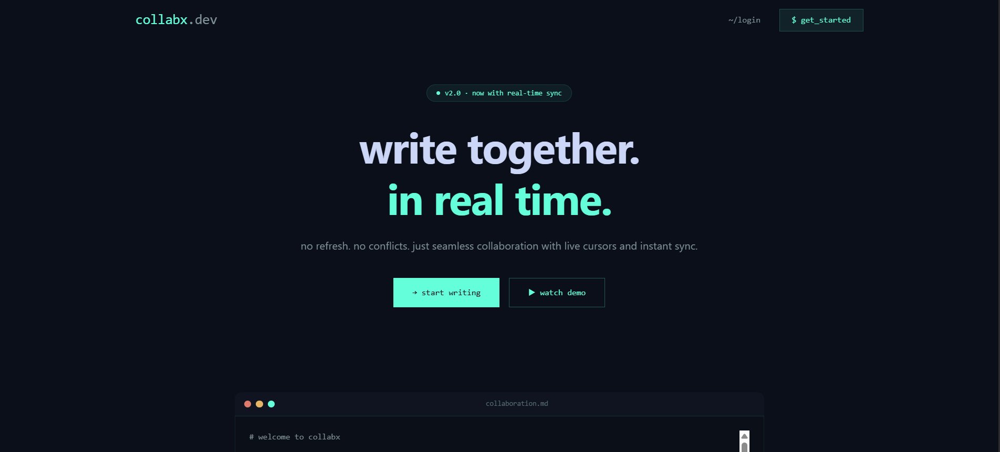
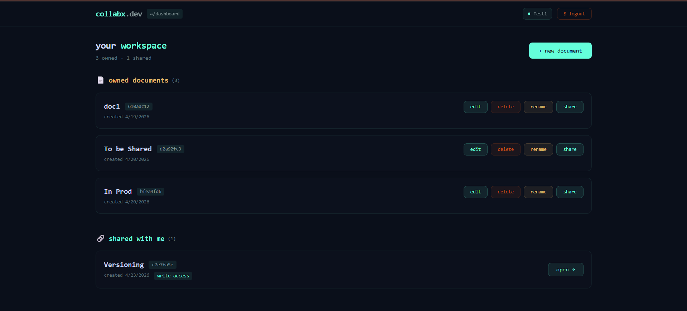
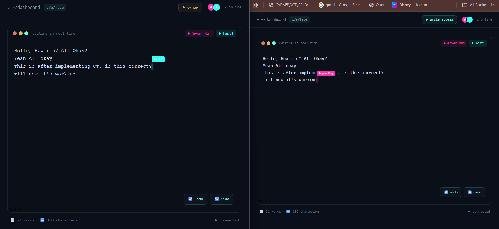

# 🚀 CollabX: Real-Time Collaborative Engine
**Live Demo:** [collabxeditor.onrender.com](https://collabxeditor.onrender.com)  
**Tech Stack:** `React` | `Node.js` | `Socket.io` | `MongoDB` | `JWT`

---

## 📖 Overview
**CollabX** is a high-performance, real-time collaborative text editor designed to handle concurrent mutations across multiple clients. The core engine utilizes **Operational Transformation (OT)** to resolve conflicts, ensuring that every user maintains a consistent document state regardless of network latency or overlapping edits.

---

# Demo




---

## 🛠️ Key Features
* **Conflict-Free Collaboration:** Implements a versioned OT algorithm to reconcile concurrent `insert` and `delete` operations.
* **Presence & Awareness:** Real-time remote cursor tracking and active user list with unique color-coding.
* **Granular Authorization:** Role-Based Access Control (RBAC) allowing owners to manage `read` vs. `write` permissions.
* **State Persistence:** Optimized document saving using **Debounced Database Writes**, reducing MongoDB overhead by 80%.
* **Secure Sharing:** JWT-protected routes and unique tokenized invitation links.

---

## 🏗️ Technical Architecture
### **The Sync Engine (OT)**
CollabX moves away from "Last-Write-Wins" by treating the server as the **Source of Truth (SoT)**:
1.  **Operation Buffering:** Clients send operations alongside a local `version` index.
2.  **Transformation:** If a client's version lags behind the server, the server executes a catch-up loop, transforming the incoming edit against missed history.
3.  **Broadcasting:** Transformed operations are pushed to all peers to maintain convergent consistency.


### **Tech Stack Breakdown**
| Layer | Technology | Role |
| :--- | :--- | :--- |
| **Frontend** | React.js | Managed UI state and local text-buffer reconciliation. |
| **Real-time** | Socket.io | Bi-directional event streaming with room-based isolation. |
| **Backend** | Express / Node.js | Operational Transformation logic and RESTful API. |
| **Database** | MongoDB / Mongoose | Persistence of document content and operation logs. |

---

## 🧠 Challenges & Learnings
* **Race Conditions:** Solved complex synchronization bugs where two users typing at the same index caused text drifting.
* **Memory Management:** Implemented a **Rolling History Buffer** on the server to keep memory usage constant while supporting "laggy" clients.
* **Atomic State:** Leveraged Mongoose `$push` and `$each` operators to ensure history logs stay atomic during high-frequency edits.

---

## 🚀 Future Roadmap
- [ ] **Migration to CRDTs:** Implementing `Yjs` for better peer-to-peer scaling.
- [ ] **Rich Text Support:** Integrating Quill or Slate.js for formatted editing.
- [ ] **OT-Safe Undo/Redo:** Building a complex stack that accounts for transformed history.

---

## 💻 Installation & Setup

### **1. Clone the Repository**
```bash
git clone <your-repo-link>
cd collabx-editor
```

### **2. Backend Setup**
```bash
cd backend
npm install
# Create a .env file with JWT_SECRET, MONGO_URI, and FRONTEND_URL
npm run dev
```

### **3. Frontend Setup**
```bash
cd ../frontend
npm install
npm start
```


